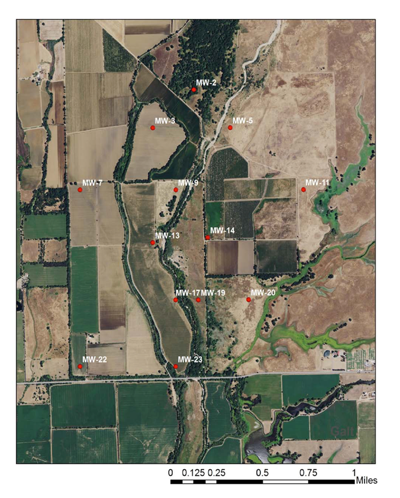

# Groundwater Monitoring

## Contact

 - Nick Newcomb
 - Amanda D'Elia

## Files

### Monitoring Well Depths
Depths of all monitoring wells including total depth, screen depths and depth at which grout begins. Map of well locations at site included. Data collected by N. Newcomb

### Well Log Data
Data from well installation including well spatial information, sediment sample information and in field texture analysis data. Data compiled by N. Newcomb.

### Water Quality Data
Data collected from 2/2014 through 11/2015 from all monitoring wells and the Cosumnes River at the low water crossing.  Some data collection (DO, T, EC, and pH) began in Winter 2015. Only subsection of samples (quarterly) were analyzed for major cations and anions. Only samples with greater than 0.02 umol NO3 were sent for 15N and 18O isotopic signatures. Data collected and compiled by A. D'Elia
