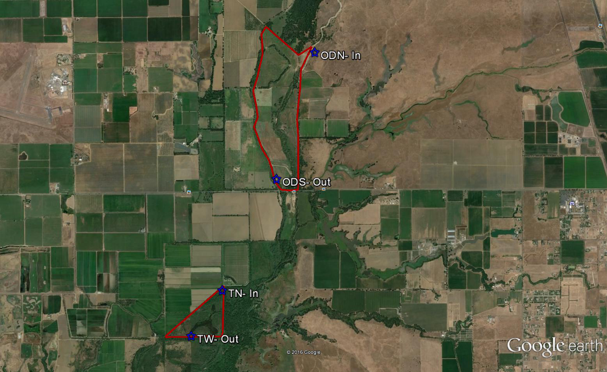
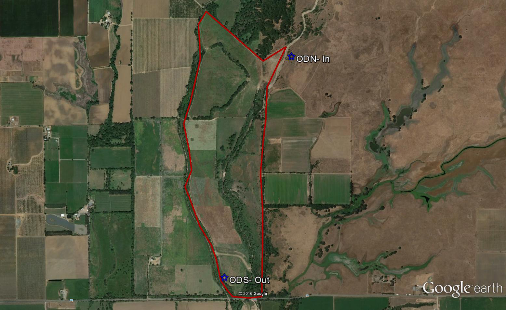
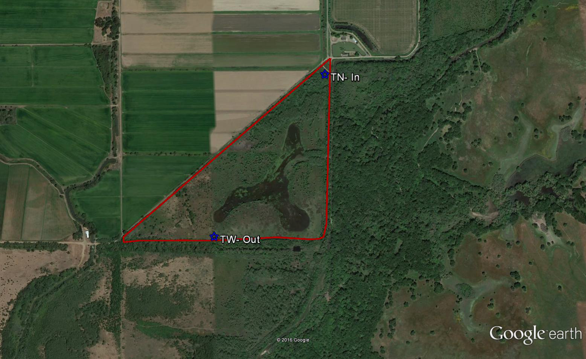

# Task… Water Quality Monitoring
	This monitoring has extended the initial study conducted by UC Davis on the Triangle Floodplain in 2004 (Gallo, unpublished data) with the intention of exploring how those results are affected by changes in spatial scale. We are replicating the methods and analysis at Triangle site to examine potential changes since the initial study, as well as conducing a pilot study at the Oneto site to examine if similar processes occur across the much larger floodplain.  

    The focus of this study has been changes in water quality as water flows across the floodplain. We are monitoring water quality changes during river-floodplain connectivity (flooding), floodplain draining, and floodplain ponding phases of the flood (Gallo, unpublished data).

## Sampling Design
	We have placed two automated samplers (ISCO 6700 or equivalent) at each floodplain to sample inflow and outflow water quality. At the Triangle floodplain the samplers will be placed at TN and TW, with water coming onto the floodplain at TN   and exiting at TW (Figure 3).  On the Oneto floodplain, samplers will be placed at ODN to sample water onto the floodplain and at ODS to sample water leaving the floodplain (Figure 2).
	Samplers are programmed to collect 1000ml of water every other hour, during flood events. Samples are collected no more than every 48 hours from each of the four automated samplers. Samples are placed on ice and brought into the lab for immediate analysis. Water samples are analyzed for the following variables:

    | Constituent                     | Abbreviation |
    |---------------------------------|--------------|
    | pH/ EC                          |              |
    | Turbidity/Total Suspended Solid | TSS          |
    | Volatile Suspended Solid        | VSS          |
    | Ammonium concentration          | NH4          |
    | Nitrate concentration           | NO3          |
    | Total Nitrogen                  | TN           |
    | Phosphate Concentration         | PO4          |
    | Total Phosphorus                | TP           |

    Data analysis requires modeled flows across both flood plains, and as floods are a potential for the coming months, analysis have not yet been conducted. Data will continue to be collected and will be analyzed when modeled flows are completed. Any analysis will be submitted as addendum to the year-end report.

## Figures
### Figure 1 - Overview of study sites

### Figure 2 - Oneto-Denier site with study locations

### Figure 3 - Triangle site with  study locations

